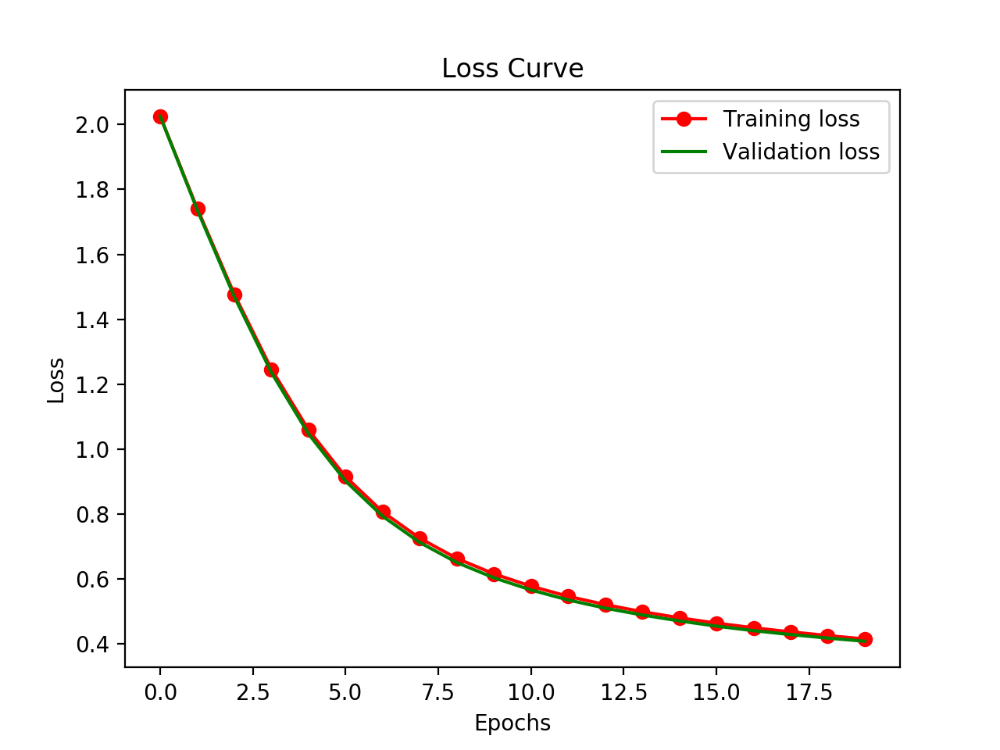
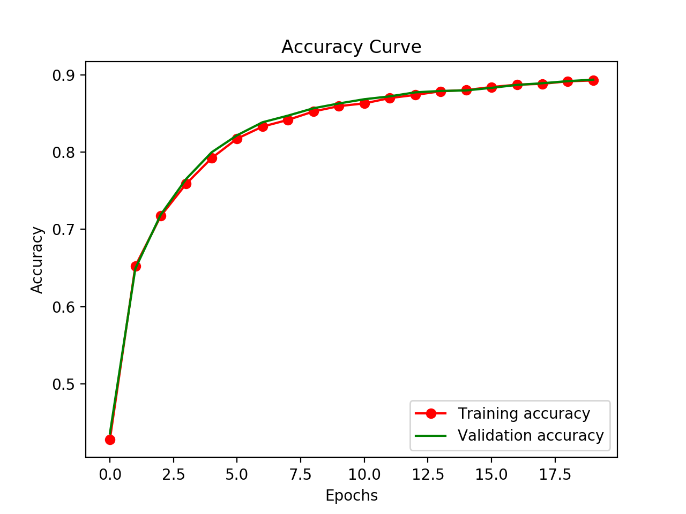
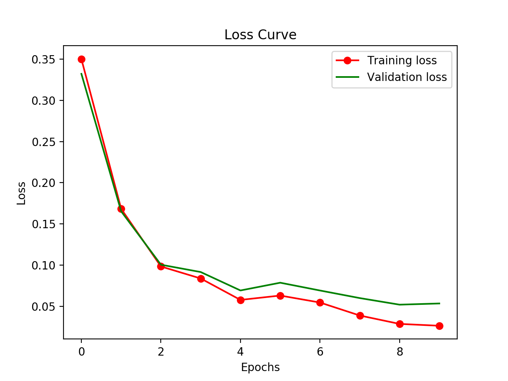
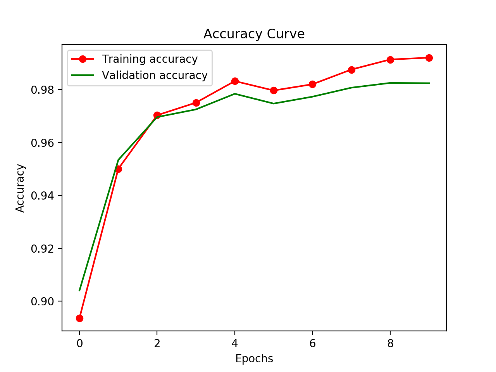

# DNet
Neural Network Library written in Python and built on top of JAX, an open-source high-performance automatic differentiation library.

## Packages used
* [JAX](https://github.com/google/jax) for automatic differentiation.
* [Mypy](https://github.com/python/mypy) for static typing Python3 code.
* [Matplotlib](https://github.com/matplotlib/matplotlib) for plotting.
* [Pandas](https://github.com/pandas-dev/pandas) for data analysis / manipulation.
* [tqdm](https://github.com/tqdm/tqdm) for displaying progress bar.
* [NumPy](https://github.com/numpy/numpy) for randomization.

## Features
* Enables high-performance machine learning research.
* Supports FFNN and CNN models.
* Built-in support of popular optimization algorithms and activation functions.
* Easy to use with high-level Keras-like APIs.
* Runs seamlessly on CPU, GPU and even TPU! without any configuration required.

## Examples

### MNIST Fully-connected neural network (FFNN)

#### Code
```python3
from pathlib import Path

import jax.numpy as tensor
import pandas as pd

from dnet.layers import FC
from dnet.models import Sequential

current_path = Path("..")
train_path = current_path / "datasets" / "mnist_small" / "mnist_train_small.csv"
test_path = current_path / "datasets" / "mnist_small" / "mnist_test.csv"

training_data = pd.read_csv(train_path, header=None)

y_train = tensor.asarray(pd.get_dummies(training_data[0]))  # One-hot encoding output shape : (m, ny)
x_train = tensor.asarray(training_data.iloc[:, 1:].values) / 255.0  # shape = (m, nx)

testing_data = pd.read_csv(test_path, header=None)

y_val = tensor.asarray(pd.get_dummies(testing_data[0]))  # One-hot encoding output shape : (m, ny)
x_val = tensor.asarray(testing_data.iloc[:, 1:].values) / 255.0  # shape = (m, nx)

model = Sequential()
model.add(FC(units=500, activation="relu"))
model.add(FC(units=50, activation="relu"))
model.add(FC(units=10, activation="softmax"))
model.compile(loss="categorical_crossentropy", optimizer="momentum", lr=1e-03, bs=512)
model.fit(inputs=x_train, targets=y_train, epochs=20, validation_data=(x_val, y_val))

model.plot_losses()
model.plot_accuracy()
```

#### Output
```terminal
/Library/Frameworks/Python.framework/Versions/3.7/lib/python3.7/site-packages/jax/lib/xla_bridge.py:119: UserWarning: No GPU/TPU found, falling back to CPU.
  warnings.warn('No GPU/TPU found, falling back to CPU.')
Epoch 20, Batch 40: 100%|██████████| 20/20 [00:15<00:00,  1.30it/s, Validation accuracy => 0.8935999870300293]

Process finished with exit code 0
```




### MNIST Convolutional neural network (CNN)

#### Code
```python3
from pathlib import Path

import jax.numpy as tensor
import pandas as pd

from dnet.layers import Conv2D, MaxPool2D, Flatten, FC
from dnet.models import Sequential

current_path = Path("..")
train_path = current_path / "datasets" / "mnist_small" / "mnist_train_small.csv"
test_path = current_path / "datasets" / "mnist_small" / "mnist_test.csv"

training_data = pd.read_csv(train_path, header=None)

y_train = tensor.asarray(pd.get_dummies(training_data[0]))  # One-hot encoding output shape : (m, nc)
x_train = tensor.asarray(training_data.iloc[:, 1:].values.reshape(-1, 28, 28, 1)) / 255.0  # shape = (m, h, w, c)

testing_data = pd.read_csv(test_path, header=None)

y_val = tensor.asarray(pd.get_dummies(testing_data[0]))  # One-hot encoding output shape : (m, nc)
x_val = tensor.asarray(testing_data.iloc[:, 1:].values.reshape(-1, 28, 28, 1)) / 255.0  # shape = (m, h, w, c)

model = Sequential()
model.add(Conv2D(filters=6, kernel_size=(5, 5), activation="relu"))
model.add(MaxPool2D(pool_size=(2, 2)))
model.add(Conv2D(filters=16, kernel_size=(5, 5), activation="relu"))
model.add(MaxPool2D(pool_size=(2, 2)))
model.add(Flatten())
model.add(FC(units=120, activation="relu"))
model.add(FC(units=84, activation="relu"))
model.add(FC(units=10, activation="softmax"))
model.compile(loss="categorical_crossentropy", optimizer="adam", lr=1e-03, bs=512)
model.fit(inputs=x_train, targets=y_train, epochs=10, validation_data=(x_val, y_val))

model.plot_losses()
model.plot_accuracy()
```

#### Output
```
/Library/Frameworks/Python.framework/Versions/3.7/lib/python3.7/site-packages/jax/lib/xla_bridge.py:119: UserWarning: No GPU/TPU found, falling back to CPU.
  warnings.warn('No GPU/TPU found, falling back to CPU.')
Epoch 10, Batch 40: 100%|██████████| 10/10 [01:41<00:00, 10.17s/it, Validation accuracy => 0.9824000000953674]

Process finished with exit code 0
```




## Roadmap
Check the [roadmap](https://github.com/umangjpatel/dnet/projects/2) of this project. This will show you the progress in the development of this library.

## Developers
* [Umang Patel](https://github.com/umangjpatel)
